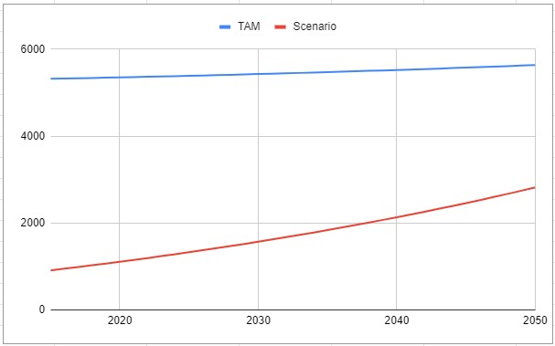
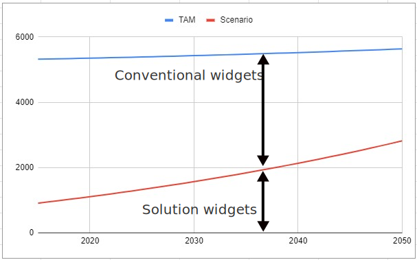

In RRS Solutions, there is assumed to be a "total addressable market", or demand, for a good/service/benefit which can be projected over the modeling period.  The solution is used to fulfill some part of the demand, which we call the "projected adoption"; each Scenario will typically have a different projected adoption.  Any part of the demand that is not met by the solution is assumed to be met by some (mix of) "conventional" technology.  The following diagram illustrates this concept:

The top line is the total addressable market of something&mdash;let's call them widgets. The total demand for widgets is growing over time.  Our solution is already providing some of those widgets, as indicated by the lower line.  In this scenario, we assume the solution is being expanded faster than the demand, which means that the amount of widgets provided by conventional technology will decrease.

At any time, we can calculate a quantity, such as the total CO2 emissions for widgets, by summing the formula for the Solution and Conventional parts.  For example:

    widget_co2(year) = soln_co2_per_widget * solution_production(year) + conv_co2_per_widget * conventional_production(year)
                     = soln_co2_per_widget * adoption(year) + conv_co2_per_widget * (tam(year) - adoption(year))

There is one more step: we typically want to talk about how much impact a solution will have in a given scenario.  To do this, we need to compare equations like the one above to some "baseline".  The baseline isn't the same as "no deployment of the solution"&mdash;as we can see in this example, the solution is already being used, and may even grow over time without any help.  To talk about this, we introduce the idea of the _reference scenario_.  Each solution has a reference scenario, which like the TAM, is the researcher's best estimate of how the use/deployment of the solution will evolve over time even if no policy changes or explicit investments are made.  So our actual 

